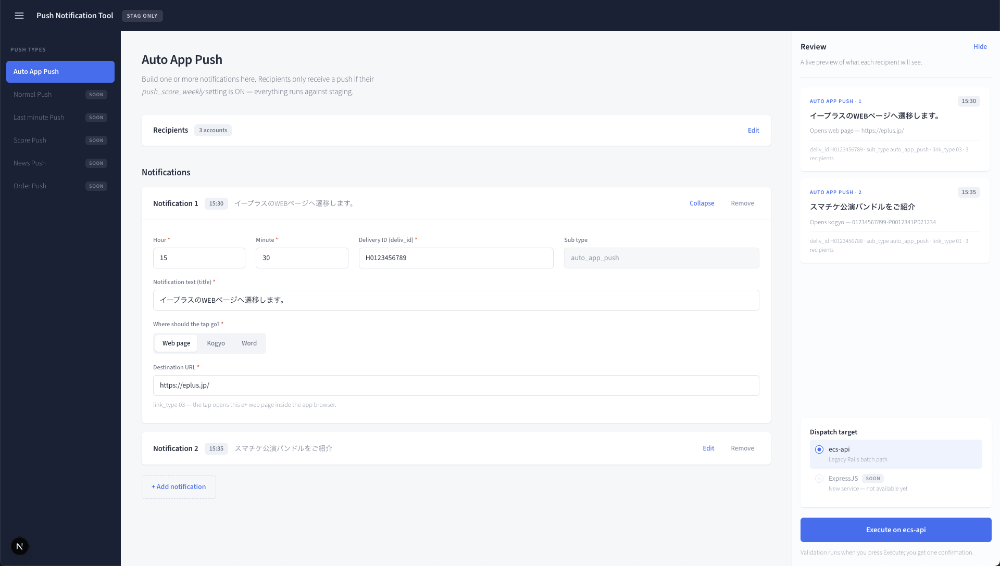

# fe-push-notification-tool

Console UI for the Push Notification Tool (STAG only). Built from the Claude Design project `push-tool-console`.



## Run

```bash
yarn install
yarn dev
```

Opens at http://localhost:3000.

## Structure

- `src/app/layout.tsx` — root layout, loads Source Sans 3 via `next/font` and `globals.css`
- `src/app/page.tsx` — the single route, renders `PushConsole`
- `src/components/PushConsole.tsx` — client component holding all page state (rows, recipients, dispatch target, validation, confirm/done flow)
- `src/lib/types.ts` — row model, link-type metadata, validation rules
- `src/components/` — Header, Sidebar, RecipientsSection, NotificationRowCard, ReviewRail, ConfirmDialog, DoneView
- `src/app/globals.css` — design tokens and layout/responsive rules

Execution is currently local only (no API call yet) — `execute()` in `PushConsole.tsx` is the hook-up point for the backend.
