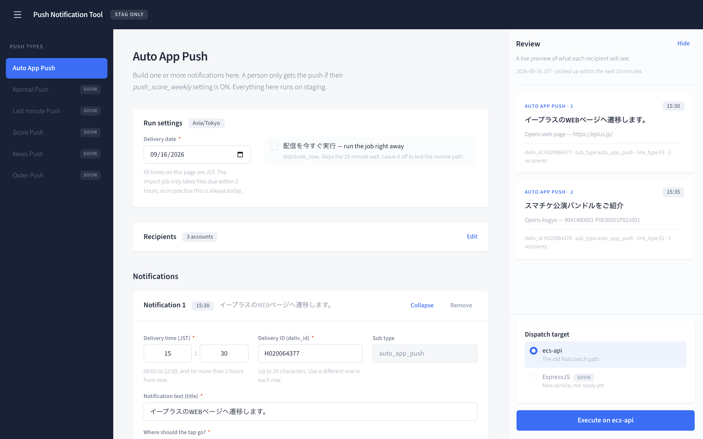
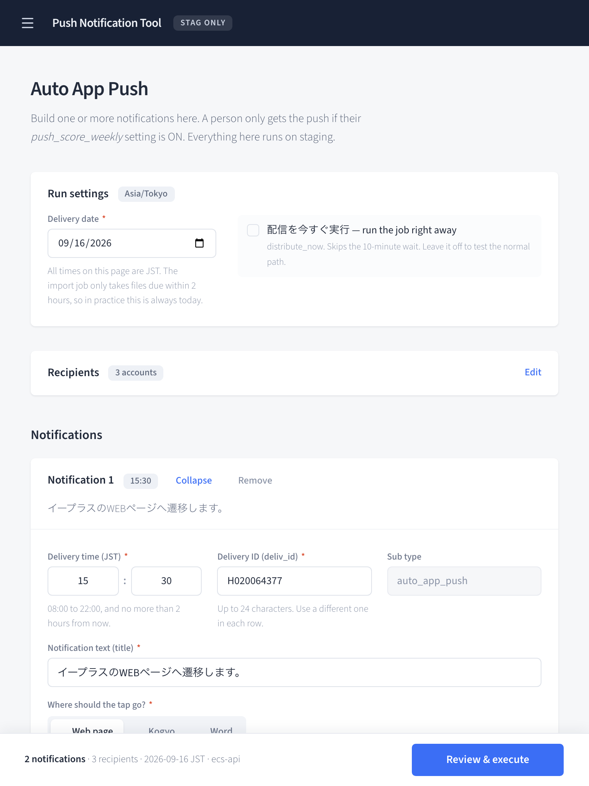
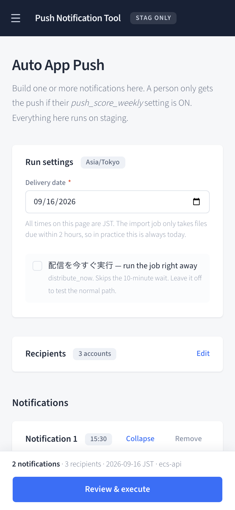

# fe-push-notification-tool

Console UI for the Push Notification Tool (STAG only). Built from the Claude Design project `push-tool-console`.



## Run

```bash
yarn install
cp .env.example .env.local   # then fill in ECS_API_URL
yarn dev
```

Opens at http://localhost:3000.

## Configuration

Executing a run posts to `ecs-api` at `POST /api/test_notification/auto_app_pushes` (see
`docs/API-DOC-auto-app-push.md`). One server-only env var is required:

| Variable | Notes |
|---|---|
| `ECS_API_URL` | Base URL of the ecs-api host. Staging and below — the endpoint 404s on production. |

It must not be prefixed `NEXT_PUBLIC_`. It is read only inside the route handler, so the browser
never has to get past the API's CORS allowlist. Without it, the Execute button returns a 500 telling
you what is missing — the UI itself still runs.

The `X-APIToken` is not configured anywhere: the tester pastes it into the **API token** field under
*Dispatch target → ecs-api* before each session. The staging value lives in SSM at `/epica/stg/api`.
The page sends it with each run and never stores it.

## Screenshots

Below 1180px the sidebar and the review rail become drawers, and a sticky bar at the bottom holds
the run summary and the "Review & execute" button.

| Tablet (768px) | Mobile (390px) |
|---|---|
|  |  |

## Structure

- `src/app/layout.tsx` — root layout, loads Source Sans 3 via `next/font` and `globals.css`
- `src/components/ui/` — shadcn/ui primitives (Radix), tuned to the design tokens
- `src/app/page.tsx` — the single route, renders `PushConsole`
- `src/app/api/push/auto-app-push/route.ts` — server-side proxy that adds `X-APIToken` and forwards to ecs-api
- `src/components/PushConsole.tsx` — client component holding all page state (rows, recipients, date, dispatch target, validation, submit/done flow)
- `src/lib/types.ts` — row model, link-type metadata, JST time helpers, validation rules
- `src/lib/api.ts` — request/response types, payload builder, and the `201 / 400 / 401 / 404` branching
- `src/lib/storage.ts` — remembers the last-used login IDs and `distribute_now` between runs
- `src/components/` — Header, Sidebar, RunSettings, RecipientsSection, NotificationRowCard, ReviewRail, ConfirmDialog, DoneView
- `src/app/globals.css` — Tailwind v4 + shadcn imports, design tokens, react-toastify re-theme

A `201` means the delivery file reached S3, not that anything was sent, so the done screen says
*scheduled*. Pickup runs on a 10-minute tick (immediately if `distribute_now` is on), and login IDs
are filtered against `push_score_weekly` afterwards, silently.
